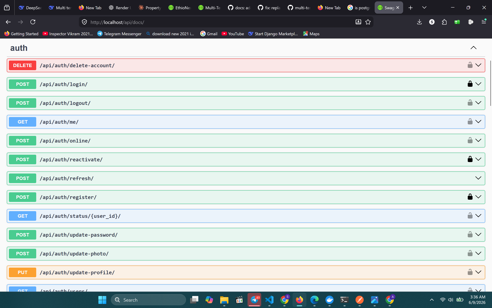
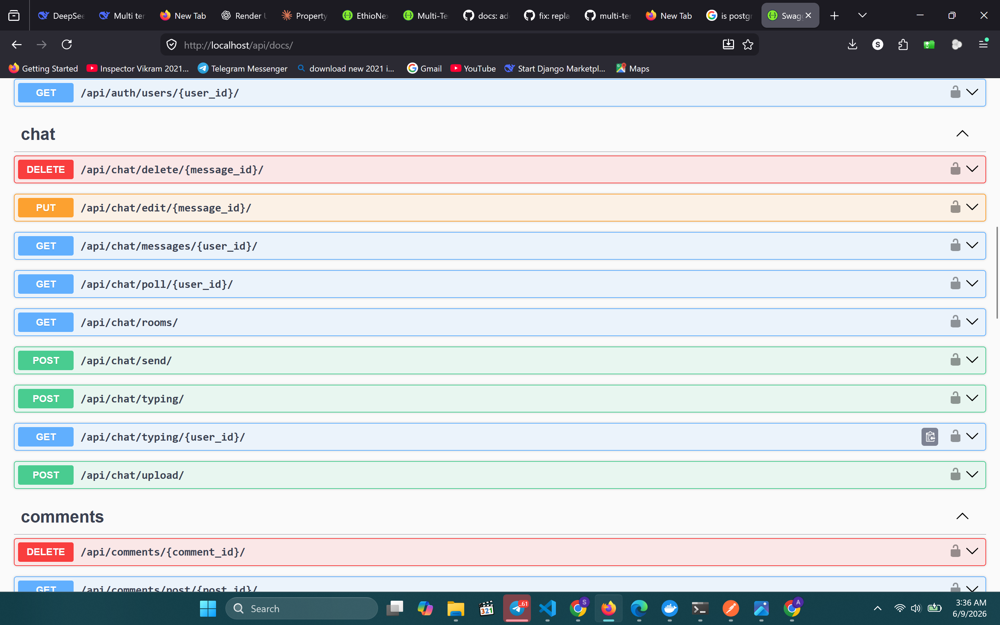
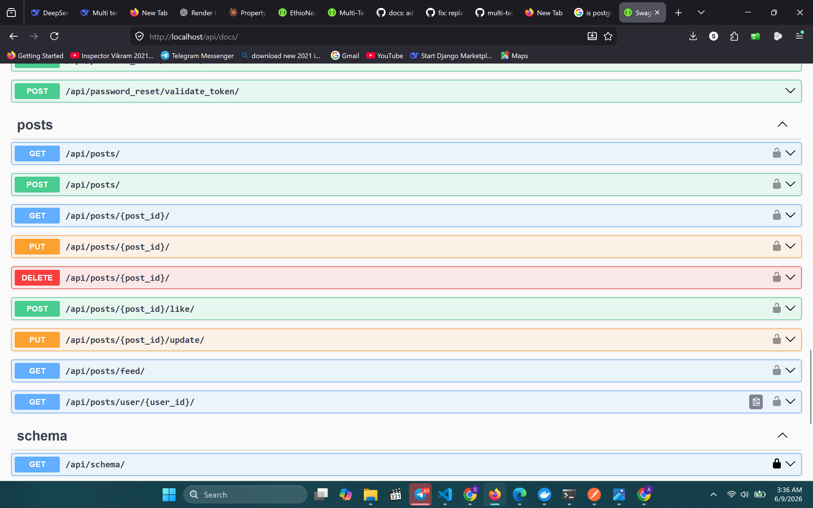
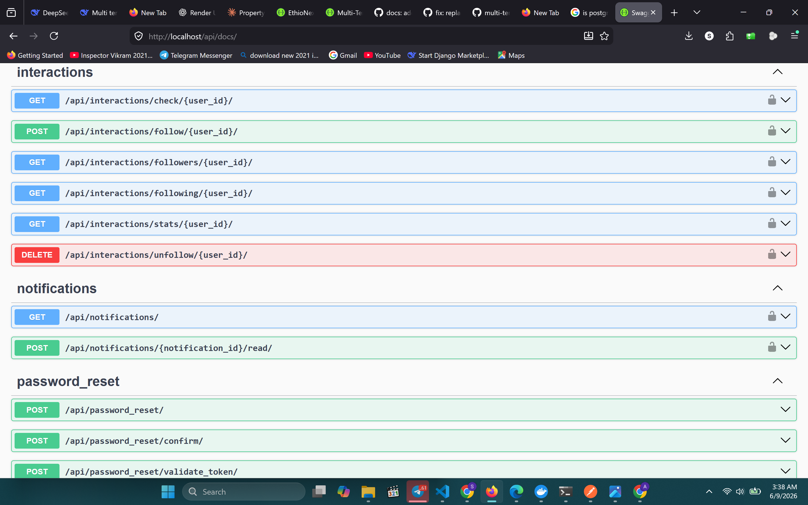

# Social Media API


- 125 automated tests
- 85% code coverage
- Unit + integration + performance test layers
- 0 failed tests
- WebSocket consumer tests included
- Permission and role-based tests included


## 📸 API Documentation Preview

> Full interactive documentation available at `/api/docs/`

### Overview & Authentication


### Posts & Interactions


### Chat & Notifications


### Comments & Follow System



## 📊 Quality Metrics


> A production-ready social media REST API — users post, follow, like, comment, and chat in real time. Built with Django REST Framework, PostgreSQL, Redis, Celery, Django Channels (WebSockets), and Docker.

---

## ⚡ Why This Project?

| Challenge | Solution |
|-----------|----------|
| Real-time chat | Django Channels WebSockets + HTTP polling fallback |
| Duplicate chat rooms | UUID5 from sorted user IDs — always deterministic |
| Feed performance | Redis-cached paginated feed with signal-based invalidation |
| Email blocking HTTP | All notifications dispatched as Celery background tasks |
| Auth security | JWT rotation + blacklisting + rate limiting |
| Safe account deletion | Soft delete — preserves referential integrity |

---

## 🚀 Key Highlights

- JWT authentication with access/refresh tokens, email verification, and password reset
- Post system with likes and paginated feed based on follows
- Real-time one-on-one chat via Django Channels and WebSockets with HTTP polling fallback
- Follow/unfollow social graph with self-follow and duplicate prevention
- Background email notifications via Celery + Redis
- Redis caching for feed, user data, post detail, and comments with signal-based invalidation
- Nginx reverse proxy with Daphne (ASGI/WebSocket)
- 125 automated tests with 85% code coverage

---

## 🛠 Tech Stack

| Layer | Technology |
|-------|-----------|
| Backend | Django 5.2, Django REST Framework 3.15 |
| Database | PostgreSQL 16 |
| Cache & Broker | Redis 7 |
| Background Tasks | Celery 5.4 + django-celery-beat |
| Real-Time | Django Channels 4.3 + Daphne 4.2 |
| Authentication | JWT via SimpleJWT 5.3 |
| File Handling | Pillow 12.2, Django Storages 1.14 |
| API Docs | drf-spectacular (Swagger/OpenAPI 3.0) |
| Testing | pytest 8.2 + pytest-django + pytest-cov |
| Containerization | Docker + Docker Compose |
| Reverse Proxy | Nginx alpine |

---

## 🏗 System Architecture
Client (React / Mobile)
↓
Nginx (port 80)
├── /ws/  → Daphne (WebSockets)
└── /     → Django REST API (HTTP)
↓
PostgreSQL 16        Redis 7
(Primary DB)    (Cache + Celery Broker)
↓
Celery Workers
Celery Beat (Scheduler)

---

## 🗄 Data Model
User ──< Post ──< Like
──< Comment
──< Follow >── User
──< ChatRoom >── User
└──< Message
──< Notification

---

## 📁 Project Structure

```
social-media-api/
├── accounts/            # Auth, registration, email verification, password reset
├── posts/               # Posts, likes, feed
├── comments/            # Nested comments on posts
├── interactions/        # Follow/unfollow social graph, like services
├── chat/                # Chat rooms, messages, WebSocket consumers
├── notify/              # Notifications, WebSocket consumers, Celery tasks
├── config/              # Settings, URLs, cache utils, permissions, throttling
└── tests/               # Full test suite
    ├── unit/            # Direct function/view tests
    ├── integration/     # Full HTTP social flow tests
    └── performance/     # Rate limiting and caching benchmarks
```

## 📡 API Endpoints

### Authentication — `/api/v1/auth/`

| Method | Endpoint | Description | Auth |
|--------|----------|-------------|------|
| POST | `register/` | Register + send verification email | Public |
| POST | `login/` | Login with email or username | Public |
| POST | `token/refresh/` | Get new access token | Public |
| GET | `profile/` | Current user profile | JWT |
| PATCH | `profile/` | Update username / bio / email | JWT |
| POST | `verify-email/` | Verify email token | Public |
| POST | `resend-verification/` | Resend verification email | Public |
| POST | `password-reset/` | Request password reset link | Public |
| POST | `password-reset/confirm/` | Confirm and set new password | Public |

### Posts — `/api/v1/posts/`

| Method | Endpoint | Description | Auth |
|--------|----------|-------------|------|
| GET | `posts/` | Paginated feed (cached) | JWT |
| POST | `posts/` | Create a post | JWT |
| GET | `posts/<id>/` | Post detail | JWT |
| PATCH/DELETE | `posts/<id>/` | Update or delete own post | JWT (owner) |
| POST | `posts/<id>/like/` | Like a post | JWT |
| DELETE | `posts/<id>/unlike/` | Unlike a post | JWT |
| GET/POST | `posts/<id>/comments/` | List or create comment | JWT |

### Follow System — `/api/v1/`

| Method | Endpoint | Description | Auth |
|--------|----------|-------------|------|
| POST | `follow/<user_id>/` | Follow a user | JWT |
| DELETE | `unfollow/<user_id>/` | Unfollow a user | JWT |
| GET | `followers/` | List own followers | JWT |
| GET | `following/` | List who you follow | JWT |

### Chat — `/api/v1/chat/`

| Method | Endpoint | Description | Auth |
|--------|----------|-------------|------|
| GET | `rooms/` | List chat rooms | JWT |
| POST | `send/` | Send a message | JWT |
| GET | `history/<room_id>/` | Chat history | JWT |

### Notifications — `/api/notifications/`

| Method | Endpoint | Description | Auth |
|--------|----------|-------------|------|
| GET | `/` | List notifications | JWT |
| POST | `<id>/mark-read/` | Mark notification as read | JWT |
| POST | `mark-all-read/` | Mark all as read | JWT |

### WebSockets

| Type | URL | Description | Auth |
|------|-----|-------------|------|
| WS | `ws://.../ws/notifications/` | Real-time notifications | JWT |
| WS | `ws://.../ws/chat/<room_id>/` | Real-time chat | JWT |

---

## 💡 Example API Usage

**Register:**
```bash
curl -X POST http://localhost/api/v1/auth/register/ \
  -H "Content-Type: application/json" \
  -d '{
    "email": "user@example.com",
    "username": "andualem",
    "full_name": "Andualem Getachew",
    "password": "SecurePass123",
    "password2": "SecurePass123"
  }'
```

**Create a post:**
```bash
curl -X POST http://localhost/api/v1/posts/posts/ \
  -H "Authorization: Bearer <access_token>" \
  -H "Content-Type: application/json" \
  -d '{"content": "Hello world from the API!"}'
```

**Send a chat message:**
```bash
curl -X POST http://localhost/api/v1/chat/send/ \
  -H "Authorization: Bearer <access_token>" \
  -H "Content-Type: application/json" \
  -d '{"recipient_id": "<user_uuid>", "content": "Hey!"}'
```

---

## ⚡ Performance Strategy

### Redis Caching

| Data | TTL |
|------|-----|
| User data | 5 min |
| Feed pages | 1 min |
| Post detail | 5 min |
| Comments | 1 min |
| Notifications | 1 min |

Cache is invalidated automatically via Django signals on save/delete.

### Database Optimization
- Indexes on `created_at` and all foreign keys
- `select_related()` for ForeignKey traversals
- `prefetch_related()` for reverse relations
- Pagination on all list endpoints

---

## ⚙️ Background Tasks (Celery)

| Task | Trigger |
|------|---------|
| `send_verification_email` | On registration |
| `send_welcome_email` | On email verified |
| `send_password_reset_email` | On forgot password |
| `create_like_notification` | On post liked |
| `create_follow_notification` | On user followed |
| `fan_out_notification_to_followers` | On new post created |

---

## 🔐 Security

- JWT with blacklisting on logout
- Rate limiting on auth endpoints
- CORS protection
- Permission classes: `IsOwner`, `IsOwnerOrReadOnly`, `IsAdminOrReadOnly`
- Soft delete (`is_deleted=True`, `is_active=False`) instead of hard delete
- Input validation via DRF serializers

---

## 🧪 Testing

```bash
# Run full test suite
docker-compose exec web pytest --tb=short -q

# With coverage report
docker-compose exec web pytest --cov=. --cov-report=term-missing

# Specific module
docker-compose exec web pytest tests/unit/test_posts.py -v
```

### ✅ Test Results: 125 passed — 85% coverage

| Module | Coverage |
|--------|----------|
| `interactions/services.py` | 100% |
| `chat/views.py` | 96% |
| `config/cache_utils.py` | 94% |
| `config/permissions.py` | 93% |
| `comments/views.py` | 92% |
| `notify/views.py` | 90% |
| `interactions/views.py` | 88% |
| `posts/views.py` | 76% |
| `accounts/views.py` | 57% |

### Test Breakdown

| Category | Tests |
|----------|-------|
| Posts (CRUD, feed, likes) | ✅ 25 tests |
| Authentication & accounts | ✅ 20 tests |
| Chat views | ✅ 20 tests |
| Cache utils | ✅ 15 tests |
| Follow system | ✅ 15 tests |
| Comments | ✅ 10 tests |
| Permissions | ✅ 10 tests |
| Notifications | ✅ 5 tests |
| Integration (social flow) | ✅ 3 tests |
| Performance benchmarks | ✅ 2 tests |

---

## 🎯 Design Decisions

**WebSocket + HTTP Polling** — Implemented both WebSocket (Django Channels) and HTTP polling fallback for chat, ensuring compatibility with environments where WebSockets are restricted.

**Deterministic Chat Rooms** — Chat rooms use UUID5 generated from sorted user IDs — `get_or_create_room(user1, user2)` always returns the same room regardless of call order, eliminating duplicate rooms.

**Redis for Both Cache and Broker** — Single Redis instance serves Celery task queue and Django cache layer, reducing infrastructure complexity while keeping concerns separate through key namespacing.

**Soft Delete** — Account deletion sets `is_deleted=True` and `is_active=False` instead of removing the record, enabling account reactivation and preserving referential integrity.

**pytest over Django TestCase** — Chosen for cleaner fixture management, parametrize support, and readable assertions — especially useful for the performance benchmark tests.

---

## 📦 Quick Start

```bash
git clone https://github.com/andugetachew/social-media-api.git
cd social-media-api
cp .env.example .env
docker-compose up --build -d
```

- API: `http://localhost/`
- Swagger Docs: `http://localhost/api/docs/`
- Admin Panel: `http://localhost/admin/`

---

## 🔑 Environment Variables

```env
SECRET_KEY=your-secret-key
DEBUG=False

DB_NAME=social_media_db
DB_USER=postgres
DB_PASSWORD=yourpassword
DB_HOST=db
DB_PORT=5432

REDIS_URL=redis://redis:6379/0
CELERY_BROKER_URL=redis://redis:6379/0
CELERY_RESULT_BACKEND=redis://redis:6379/0

EMAIL_HOST=smtp.gmail.com
EMAIL_PORT=587
EMAIL_HOST_USER=your@email.com
EMAIL_HOST_PASSWORD=your-app-password
EMAIL_USE_TLS=True
DEFAULT_FROM_EMAIL=noreply@yourdomain.com

FRONTEND_URL=http://localhost:3000
```

---

## 🐳 Docker Services

```bash
docker-compose up --build -d
```

| Service | Description | Port |
|---------|-------------|------|
| web | Django + Daphne (ASGI) | 8002 |
| nginx | Reverse proxy | 80 |
| db | PostgreSQL 16-alpine | — |
| redis | Cache + Message broker | — |
| celery | Background task worker | — |
| celery-beat | Periodic task scheduler | — |

---

## 📄 License

MIT License

---

## 👨‍💻 Author

**Andualem Getachew**

[](https://github.com/andugetachew)
[](mailto:andugeta41@gmail.com)